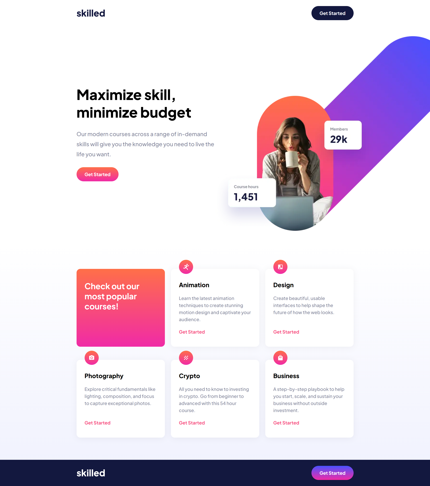

# Frontend Mentor - Skilled e-learning landing page solution

This is a solution to the [Skilled e-learning landing page challenge on Frontend Mentor](https://www.frontendmentor.io/challenges/skilled-elearning-landing-page-S1ObDrZ8q). Frontend Mentor challenges help you improve your coding skills by building realistic projects.

## Table of contents

- [Overview](#overview)
  - [The challenge](#the-challenge)
  - [Screenshot](#screenshot)
  - [Links](#links)
- [My process](#my-process)
  - [Built with](#built-with)
  - [What I learned](#what-i-learned)
- [Author](#author)

## Overview

### The challenge

Users should be able to:

- View the optimal layout depending on their device's screen size
- See hover states for interactive elements

### Screenshot



### Links

- Solution URL: [https://github.com/KH-Ray/skilled-elearning-landing-page](https://github.com/KH-Ray/skilled-elearning-landing-page)
- Live Site URL: [https://cheery-elf-40ec05.netlify.app/](https://cheery-elf-40ec05.netlify.app/)

## My process

### Built with

- Semantic HTML5 markup
- Flexbox
- CSS Grid

### What I learned

```html
<body>
  <header class="header">
    <div class="container flex flex--between">
      
      <button class="btn btn-header">Get Started</button>
    </div>
  </header>

  <main class="main">
    <div class="top container grid grid--2-cols">
      <div class="top-left flex flex--col">
        <h1>Maximize skill, minimize budget</h1>
        <p>
          Our modern courses across a range of in-demand skills will give you
          the knowledge you need to live the life you want.
        </p>
        <button class="btn btn-top-left">Get Started</button>
      </div>

      <div class="top-right">
        
        
        
      </div>
    </div>

    <div class="bottom container mg--top-large">
      <div class="cards grid grid--3-cols">
        <div class="card card-main">
          <h2>Check out our most popular courses!</h2>
        </div>
        <div class="card card-secondary">
          
          <h3>Animation</h3>
          <p>
            Learn the latest animation techniques to create stunning motion
            design and captivate your audience.
          </p>
          <p>Get Started</p>
        </div>
        <div class="card card-secondary">
          
          <h3>Design</h3>
          <p>
            Create beautiful, usable interfaces to help shape the future of how
            the web looks.
          </p>
          <p>Get Started</p>
        </div>
        <div class="card card-secondary">
          
          <h3>Photography</h3>
          <p>
            Explore critical fundamentals like lighting, composition, and focus
            to capture exceptional photos.
          </p>
          <p>Get Started</p>
        </div>
        <div class="card card-secondary">
          
          <h3>Crypto</h3>
          <p>
            All you need to know to investing in crypto. Go from beginner to
            advanced with this 54 hour course.
          </p>
          <p>Get Started</p>
        </div>
        <div class="card card-secondary">
          
          <h3>Business</h3>
          <p>
            A step-by-step playbook to help you start, scale, and sustain your
            business without outside investment.
          </p>
          <p>Get Started</p>
        </div>
      </div>
    </div>
  </main>

  <footer class="footer mg--top-large">
    <div class="container flex flex--between">
      
      <button class="btn btn-footer">Get Started</button>
    </div>
  </footer>
</body>
```

```css
/* MAIN */

* {
  padding: 0;
  margin: 0;
  box-sizing: border-box;
}

html {
  font-size: 62.5%;
  font-family: 'Plus Jakarta Sans', sans-serif;
}

body {
  background: linear-gradient(#fff 50%, #eee);
}

.container {
  max-width: 110rem;
  margin: 0 auto;
}

.mg--top-large {
  margin-top: 6.4rem;
}

/* BUTTON */

.btn {
  width: 16.7rem;
  height: 5.6rem;
  border: none;
  border-radius: 9999px;
  font-family: 'Plus Jakarta Sans', sans-serif;
  font-weight: 700;
  font-size: 1.8rem;
}

.top-left p:has(+ .btn-top-left:hover),
.btn:hover {
  cursor: pointer;
  opacity: 0.5;
}

/* FLEX */

.flex {
  display: flex;
}

.flex--col {
  flex-direction: column;
}

.flex--center {
  align-items: center;
  justify-content: center;
}

.flex--between {
  align-items: center;
  justify-content: space-between;
}

/* GRID */

.grid {
  display: grid;
}

.grid--2-cols {
  grid-template-columns: 50% 50%;
}

.grid--3-cols {
  grid-template-columns: repeat(3, 1fr);
}
```

## Author

- Frontend Mentor - [@UncertainlySure](https://www.frontendmentor.io/profile/UncertainlySure)
